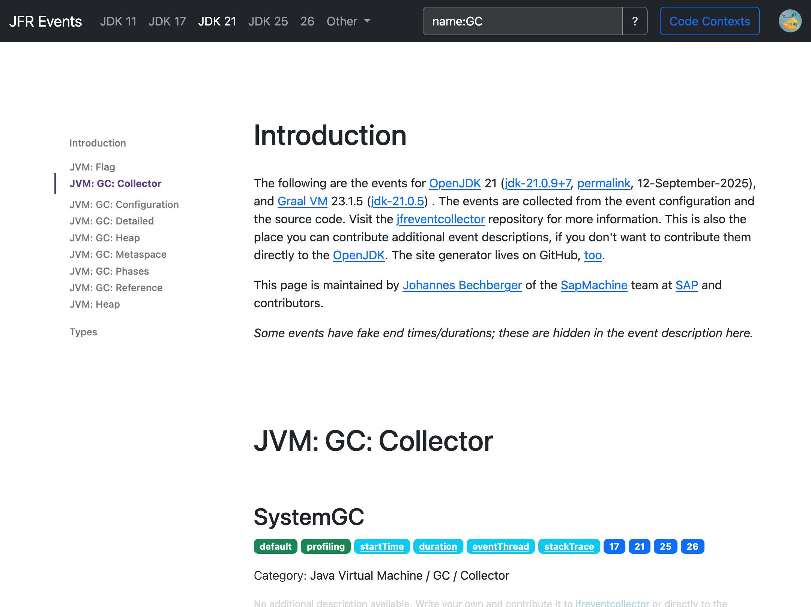

JFR Events Site Generator
=========================

Uses the data from the [jfreventscollector](https://github.com/SAP/jfrevents)
project to generate a website with all the JFR events seen at [sap.github.io/jfrevents](https://sap.github.io/jfrevents).


*This has historically been its own repository, but got merged for simplicity.*

Build
-----
```shell
# update the dependencies
mvn dependency:resolve -U
mvn clean package assembly:single
# generate it into site
java -jar target/jfrevents-site-generator.jar site
```

Site generator options:

```
Usage: jfreventcollector-site generate [--hide-missing-descriptions]
                                       [-p=<prefix>] [--goat-counter-url
                                       [=<goatCounterUrls>...]]... <target>
Generate the JFR event documentation site.
      <target>            The target directory.
      --goat-counter-url[=<goatCounterUrls>...]
                          GoatCounter is an open source web analytics platform.
                            This is the URL for GoatCounter.
      --hide-missing-descriptions
                          Hide the missing description text indicators.
  -p, --prefix=<prefix>   The filename prefix.
```

There is also the `create-forward` command to create forwarding pages for old URLs.

Development
-----------
`WatchKt` builds the version 21 of the site (currently `index.html`) every time the resources change.

## Support, Feedback, Contributing

This project is open to feature requests/suggestions, bug reports etc.
via [GitHub issues](https://github.com/SAP/jfrevents/issues).
Contribution and feedback are encouraged and always welcome.
For more information about how to contribute, the project structure,
as well as additional contribution information,
see our [Contribution Guidelines](../CONTRIBUTING.md).

## Troubleshooting
Builds might take longer on newer maven versions due to blocking
of http resources (and I don't know which).
Maven 3.6.3 seems to work fine.

## Security / Disclosure
If you find any bug that may be a security problem, please follow our instructions at
[in our security policy](https://github.com/SAP/jfrevents/security/policy) on how to report it.
Please do not create GitHub issues for security-related doubts or problems.

## Code of Conduct

We as members, contributors, and leaders pledge to make participation in our community
a harassment-free experience for everyone. By participating in this project,
you agree to abide by its [Code of Conduct](https://github.com/SAP/.github/blob/main/CODE_OF_CONDUCT.md) at all times.


License
-------
Copyright 2023 - 2025  SAP SE or an SAP affiliate company and contributors.
Please see our LICENSE for copyright and license information.
Detailed information including third-party components and their
licensing/copyright information is available via the REUSE tool.